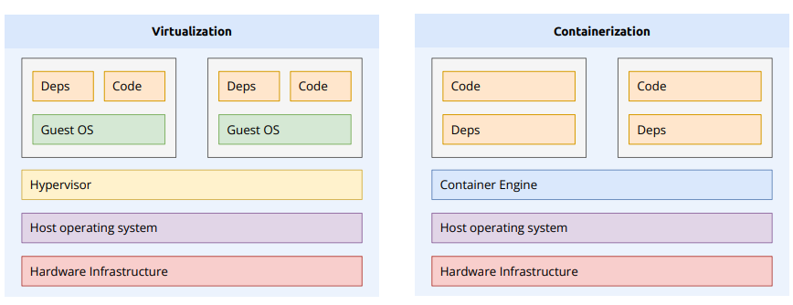
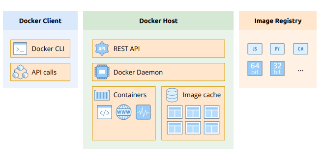
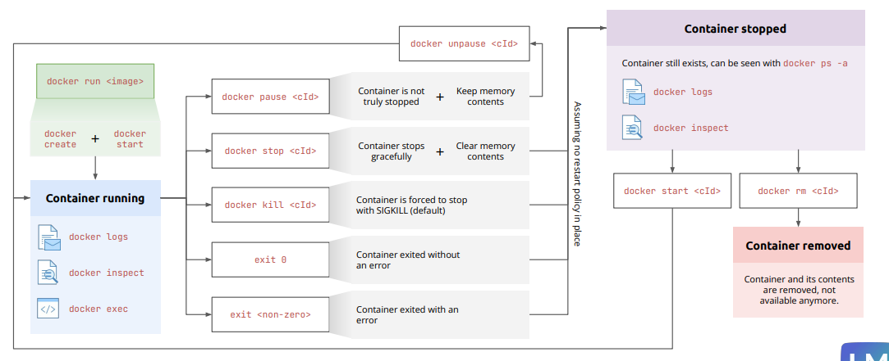
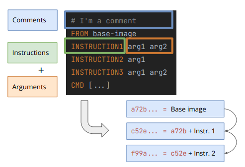

# Docker Short Notes

## Why containers?

## Containers vs VMs



## Docker client and Docker host




- Docker Client: CLI tool to interact with Docker Host.
- Docker Host: The server running Docker daemon, managing containers, images, networks, and storage
- Docker Daemon: Background service on the Docker Host that manages Docker objects.

## Docker build context

- Build context is the directory whose contents are sent to the Docker daemon when building an image.

- WE can use the .dockerignore file to exclude files/folders from the build context.

## Docker context

- Docker contexts allow you to switch between multiple Docker hosts or environments easily.

## Container lifecycle



- `docker create`
  - image is checked/pulled if not present
  - container is created in "created" state
  - `docker create -p 3000:3000 --name backend --network  backend-net backend:latest`

- `docker start`
  - container moves to "running" state
  - `docker start backend`

- `docker run`
  - shortcut for create + start
  - `docker run -d -p 3000:3000 --name backend --network backend-net backend:latest`

## Container Layers



- `docker history <image_name>` to see image layers

## Multi-stage Dockerfile

- A multi-stage Dockerfile uses multiple FROM instructions so you can build in one stage and run in another.
- A multi-stage Dockerfile separates build and runtime to produce smaller, safer Docker images.

## Distroless Images and use-cases

- Distroless images contain ONLY your application and its runtime — no OS, no shell, no package manager.

## Entrypoint vs CMD

- **Entrypoint**: The command that gets executed when a container starts. It defines the container's main process.
- **CMD**: Provides default arguments for the `ENTRYPOINT` or the command to run if no `ENTRYPOINT` is specified.

## Volumes

- **Data persists even if container is removed.**
- **Stored in Docker-managed directories (/var/lib/docker/volumes/)**


- `docker volume create my-volume`
- `docker run -v my-volume:/app/data my-image`

## Bind mount

- **Maps host directory/file → container path.**
- **Real-time sync between host and container.**
- **Good for local dev.**

- `docker run -v /host/path:/container/path my-image`

## Environment Variables

- `-e` or `--env` to set environment variables in a container.

```sh
docker run -e "VAR1=value1" -e "VAR2=value2" my-image
```

- You can also use `--env-file` to load variables from a file:

```sh
docker run --env-file ./env.list my-image
```

## CPU Limits

### 1. `--cpus` (decimal)

Limit the container to use at most _X_ number of CPUs.

```sh
docker run --cpus="1.5" ubuntu
```

- The container can use up to 1.5 CPU cores (150% of one core).

```sh
docker run --rm busybox sh -c "while true; do :; done"
```

💡 **Interpreting 100.31%:**  
On a multi-core system, CPU usage can exceed 100%.

- 1 core at full usage → 100%
- 2 cores at full usage → 200%

---

### 2. `--cpu-shares` or `-c`

Relative weight for sharing CPU between containers.  
It doesn't strictly limit CPU, just prioritizes.

```sh
docker run --cpu-shares=512 ubuntu
```

- Example:
  - One container has `-c 1024`
  - Another has `-c 512`
  - The first gets 2x more CPU than the second, if they compete.
- ⚠️ Only matters when CPU is contended. (fighting)

---

### 3. `--cpu-period` and `--cpu-quota`

These go together. Used by the Linux kernel CFS (Completely Fair Scheduler) to control CPU usage.

- `--cpu-period`: Total time window (in microseconds)
- `--cpu-quota`: How much of that time the container can run

```sh
docker run \
    --cpu-period=100000 \
    --cpu-quota=25000 \
    ubuntu
```

- Every 100ms (100,000 μs), the container can run for 25ms.
- So the container gets 25% of 1 CPU.

---

### 4. `--cpuset-cpus`

Pick which CPU cores the container can run on.

```sh
docker run --cpuset-cpus="0,2" ubuntu
```

- This tells Docker to run the container only on CPU cores 0 and 2.

## Memory Limits

### 1. `--memory` or `-m` (hard limit)

Set the maximum amount of memory the container can use.

```sh
docker run -m 512m ubuntu
```

- If the container uses more than 512 MB, it gets killed.

---

### 2. `--memory-reservation` (soft limit)

Set a soft memory limit. Docker tries to slow memory use if it goes above this value.

```sh
docker run \
    --memory=1g \
    --memory-reservation=600m \
    ubuntu
```

- Start controlling memory usage after 600 MB.
- Hard stop at 1 GB.

---

### 3. `--memory-swap`

Set the total amount of memory + swap the container can use.

```sh
docker run --memory=1g --memory-swap=2g ubuntu
```

- The container can use up to 1 GB RAM and 1 GB extra swap memory.
- Using swap slows the container.

## Restart policies

| Policy           | Behavior                                                                                                                                                             |
| ---------------- | -------------------------------------------------------------------------------------------------------------------------------------------------------------------- |
| `no` (default)   | Do not restart the container automatically.                                                                                                                          |
| `on-failure`     | Restart the container only if it exits with a **non-zero** exit code.                                                                                                |
| `on-failure:N`   | Restart only up to `N` times on failure.                                                                                                                             |
| `always`         | Docker will always restart the container if it stops.<br>Even if you stop it manually, Docker will start it again when Docker itself restarts (like after a reboot). |
| `unless-stopped` | Docker will restart the container only if it wasn’t manually stopped.<br>If you stop it manually, it will stay stopped — even after Docker restarts.                 |

## Docker networks

- **DNS name resolution only works within the same user-defined bridge network.**

| Driver  | Description                                                              |
| ------- | ------------------------------------------------------------------------ |
| bridge  | The default network driver.                                              |
| host    | Remove network isolation between the container and the Docker host.      |
| none    | Completely isolate a container from the host and other containers.       |
| overlay | Overlay networks connect multiple Docker daemons together.               |
| ipvlan  | IPvlan networks provide full control over both IPv4 and IPv6 addressing. |
| macvlan | Assign a MAC address to a container.                                     |

## Exec form vs Shell form

- **Exec form**: `["executable", "param1", "param2"]`
  - Preferred form. No shell processing.
  - Example: `ENTRYPOINT ["python", "app.py"]`
- **Shell form**: `"command param1 param2"`
  - Runs in `/bin/sh -c`. Shell features available.
  - Example: `CMD "python app.py"`
