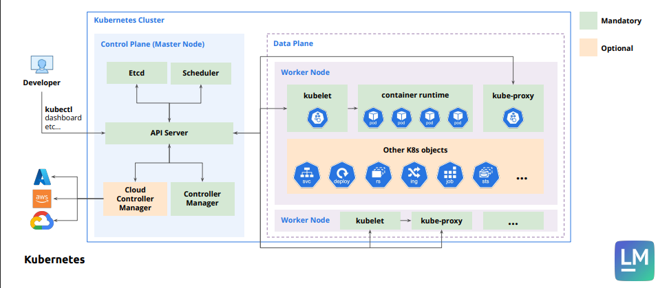

# Why k8

## minikube

## Control plane (Master node)

- **it's the brain of the cluster, containing the components responsible for managing the entire system.**
- **can exits one or more node for availability reasons**
- **each node can be on different vm**

## Worker node (data node)

- **it's where the actual applications and workloads run.**
- **can exits one or more node for availability reasons**
- **each node can be on different vm**

## How minikube works

- **has many drivers**
  - **docker**
    - **create a docker container that has k8 cluster (control plan and worker node are inside of that container)**
    - **so this creates a container a named minikube that is a docker container which also have docker inside of it**
  - virtual box
  - none driver
    - k8 directly install on top of linux

- **In the cloud (like EKS, AKS, GKE), Kubernetes runs on real virtual machines, not simulated by Minikube drivers like Docker or VirtualBox.**

- **Minikube drivers are only for local development**

## 🛑 Also minikube only has one node - by default Minikube runs everything (control-plane + workloads) on a single node.

