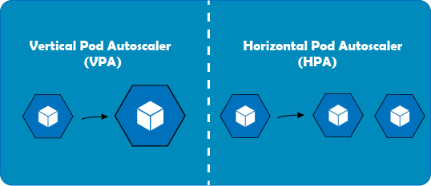

# Kubernetes HorizontalPodAutoscaler (HPA) — Readme



🧩 What Is the HorizontalPodAutoscaler?  
The HorizontalPodAutoscaler (HPA) is a Kubernetes controller that automatically adjusts the number of pod replicas in a deployment, replica set, or stateful set based on observed resource usage (like CPU or memory) or custom metrics.

It’s called “horizontal” because it scales out or in (adds/removes pods), rather than changing the resources of individual pods (vertical scaling).

⚙️ How HPA Works

- Metrics Collection  
   HPA uses the Kubernetes Metrics Server (or custom metrics API) to gather resource usage (e.g., CPU, memory, or other metrics).

- Comparison Against Target  
   It compares the current metric value (e.g., average CPU utilization) against the target you define.

- Scaling Decision  
   HPA calculates the desired number of replicas using:

  ```
  desiredReplicas = currentReplicas × currentMetric / targetMetric
  ```

  and then adjusts the replicas accordingly (within min/max limits).

- Continuous Monitoring  
   HPA checks metrics periodically (every ~15 seconds by default) and scales as needed.

🏗️ Basic Example  
Here’s a simple example of an HPA that scales pods based on CPU usage:

```yaml
apiVersion: autoscaling/v2
kind: HorizontalPodAutoscaler
metadata:
    name: my-app-hpa
spec:
    scaleTargetRef:
        apiVersion: apps/v1
        kind: Deployment
        name: my-app
    minReplicas: 2
    maxReplicas: 10
    metrics:
    - type: Resource
        resource:
            name: cpu
            target:
                type: Utilization
                averageUtilization: 70
```

Explanation:

- `scaleTargetRef`: points to the target Deployment (`my-app`).
- `minReplicas / maxReplicas`: define the allowed scaling range.
- `metrics`: defines what to scale on — here it’s CPU, targeting 70% average utilization.

📊 Using Custom Metrics  
You can also scale on custom metrics, such as request rate or queue length, via Prometheus Adapter or another custom metrics API:

```yaml
metrics:
- type: Pods
    pods:
        metric:
            name: requests_per_second
        target:
            type: AverageValue
            averageValue: 100
```

This tells HPA to maintain an average of 100 requests per second across pods.

🔧 Enabling Metrics Server  
Make sure you have the Metrics Server running:

```bash
kubectl apply -f https://github.com/kubernetes-sigs/metrics-server/releases/latest/download/components.yaml
```

Then verify:

```bash
kubectl top pods
```

If you see CPU/memory usage, HPA can now use those metrics.

🧠 Commands for Managing HPA

| Command                                                                 | Description           |
| ----------------------------------------------------------------------- | --------------------- |
| `kubectl autoscale deployment my-app --cpu-percent=70 --min=2 --max=10` | Create HPA from CLI   |
| `kubectl get hpa`                                                       | View HPA status       |
| `kubectl describe hpa my-app-hpa`                                       | Detailed scaling info |
| `kubectl delete hpa my-app-hpa`                                         | Remove the HPA        |

🧮 Example in Action  
Deploy a sample app:

```bash
kubectl create deployment php-apache --image=k8s.gcr.io/hpa-example
kubectl expose deployment php-apache --port=80
```

Apply autoscaler:

```bash
kubectl autoscale deployment php-apache --cpu-percent=50 --min=1 --max=10
```

Generate load (e.g., using `kubectl run -i --tty load-generator --image=busybox /bin/sh`).

Observe scaling:

```bash
kubectl get hpa
```

⚖️ HPA vs. VPA vs. Cluster Autoscaler

| Type               |        Scales | Based On                    | Example              |
| ------------------ | ------------: | --------------------------- | -------------------- |
| HPA                |     Pod count | CPU, memory, custom metrics | Add/remove pods      |
| VPA                | Pod resources | Resource requests/limits    | Increase pod CPU/mem |
| Cluster Autoscaler |         Nodes | Pending pods                | Add/remove nodes     |

🚨 Common Pitfalls

- Metrics Server missing → HPA shows `<unknown>` values.
- Slow scale-down → HPA waits a stabilization window (~5 mins) to avoid flapping.
- Custom metrics misconfigured → Ensure Prometheus Adapter or equivalent is properly set up.
- Too low limits → Ensure `maxReplicas` allows enough capacity.

Would you like me to walk you through a hands-on lab (with manifests, commands, and sample outputs) to see HPA behavior in real time?

---

> You said:
>
> ```yaml
> apiVersion: autoscaling/v2
> kind: HorizontalPodAutoscaler
> metadata:
>   name: my-app-hpa
> spec:
>   scaleTargetRef:
>     apiVersion: apps/v1
>     kind: Deployment
>     name: my-app
>   minReplicas: 2
>   maxReplicas: 10
>   metrics:
>     - type: Resource
>       resource:
>         name: cpu
>         target:
>           type: Utilization
>           averageUtilization: 70
> ```
>
> ok i think this scaler scale pods when averageUtilization is 70
>
> so if im use aws eks cluster , it need to scaler underlyine node (which means ec2 instances) ,
> how does the scaling happening under the hood
> also what willl happen if the nodes computation power is limited to create new pods

> ChatGPT said:
> Excellent question — and you’re absolutely right to think deeper about how HPA interacts with node-level scaling in AWS EKS (or any Kubernetes cluster).
>
> Let’s break it down carefully 👇

🧩 1. What the HPA actually does  
Your HorizontalPodAutoscaler (HPA) only controls pods, not nodes.  
It looks at metrics (like CPU) and tells the Deployment controller:

“Hey, we need 5 replicas instead of 2.”

Then, the Deployment tries to create new pods. That’s all HPA does.

It does not know or care about whether there are enough nodes in the cluster to actually schedule those pods.

⚙️ 2. What happens next (in EKS or any cluster)  
Once HPA increases the replica count:

- The Kubernetes Scheduler attempts to place the new pods on available nodes.
- If there’s not enough capacity (CPU/memory on existing nodes), those new pods will remain in a Pending state.
- The Cluster Autoscaler (CA) then steps in.

🧠 3. Enter the Cluster Autoscaler (CA)  
In AWS EKS, you typically deploy the Cluster Autoscaler as a separate component (Helm chart or manifest).  
It monitors the cluster for unschedulable pods (Pending pods).

When it detects them, it:

- Checks which Auto Scaling Group (ASG) or Managed Node Group can fit them.
- Increases the node count in that group (using AWS APIs).
- Waits for the new EC2 instances to come online.
- Once nodes register and become Ready, the scheduler places the pods there.

So the chain of events looks like this:

Load increases → HPA increases pods → Scheduler tries → Pods Pending → Cluster Autoscaler adds nodes → New pods scheduled → Load handled

🧮 4. Scaling in both directions

| Direction                | Trigger         | Who acts           | What happens              |
| ------------------------ | --------------- | ------------------ | ------------------------- |
| Scale up (more pods)     | CPU/mem high    | HPA                | Increases replica count   |
| Scale up (more nodes)    | Pods Pending    | Cluster Autoscaler | Adds EC2 nodes            |
| Scale down (fewer pods)  | CPU/mem low     | HPA                | Decreases replica count   |
| Scale down (fewer nodes) | Nodes underused | Cluster Autoscaler | Removes idle nodes safely |

🚨 5. What if node capacity is limited?  
If no more nodes can be added (e.g. max node group size reached, or AWS quota hit):

- New pods will stay in Pending state.
- The HPA will have “done its job” (it asked for more replicas), but scheduling will fail.
- You’ll see events like:

```
Warning  FailedScheduling  ...  0/5 nodes are available: insufficient CPU
```

⚙️ Options to handle it:

- Increase node group max size  
   In the AWS console → EKS → Node group → “Edit” → set larger max node count.

- Enable Cluster Autoscaler  
   Ensure it’s configured with the IAM role permissions to modify ASGs.

- Use EC2 Spot instances or Fargate profiles for burst workloads.

- Pod Priority & Preemption  
   If resources are scarce, Kubernetes can evict lower-priority pods to make room for higher-priority workloads.

🏗️ 6. What’s happening under the hood (AWS perspective)  
When the Cluster Autoscaler decides to scale out:

- It calls the AWS Auto Scaling Group API → `SetDesiredCapacity`.
- AWS EC2 spins up new instances.
- The new EC2 instances:
  - Join the EKS node group (bootstrap with IAM role & kubelet).
  - Register to the cluster as a node.
- Scheduler assigns Pending pods there.

When scaling in:

- Cluster Autoscaler finds nodes with low utilization.
- It drains them (evicts pods safely).
- Calls the ASG to decrease capacity.

💡 7. Quick visualization

```
+--------------------------+
| Metrics Server           |
+-----------+--------------+
                        |
                        v
+-----------+--------------+
| HorizontalPodAutoscaler  |
| (changes replica count)  |
+-----------+--------------+
                        |
                        v
+-----------+--------------+
| Scheduler tries to place |
| pods on available nodes  |
+-----------+--------------+
                        |
     if insufficient capacity
                        |
                        v
+-----------+--------------+
| Cluster Autoscaler       |
| (adds/removes EC2 nodes) |
+--------------------------+
```

✅ Summary

| Component            | Role                                  | Operates On          |
| -------------------- | ------------------------------------- | -------------------- |
| HPA                  | Adjusts pod replicas based on metrics | Pod level            |
| Cluster Autoscaler   | Adds/removes EC2 nodes                | Node level           |
| AWS ASG / Node Group | Actually provisions EC2 instances     | Infrastructure level |

Would you like me to show you a sample setup (YAML + Helm config) that connects HPA and Cluster Autoscaler in an EKS cluster, so you can see how they work together automatically?

No file chosenNo file chosen  
ChatGPT can make mistakes. OpenAI doesn't use Vinuka's Workspace workspace data to train its models.
