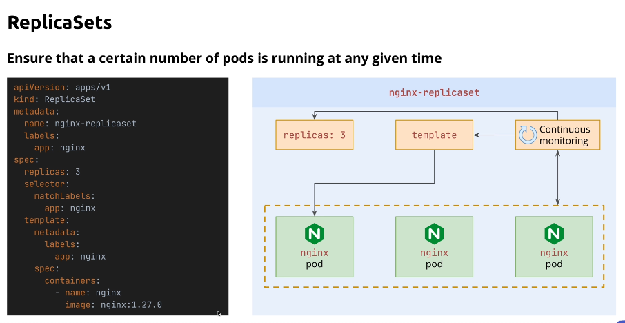
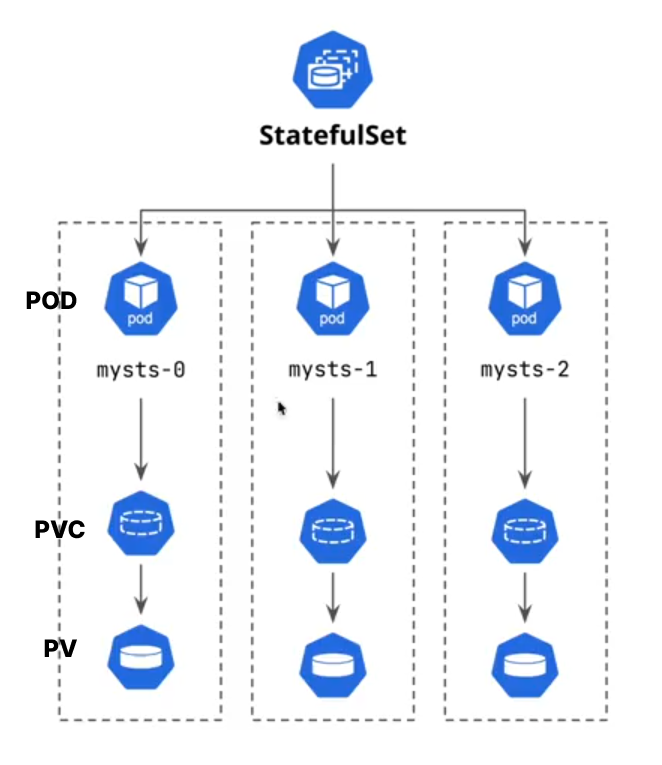
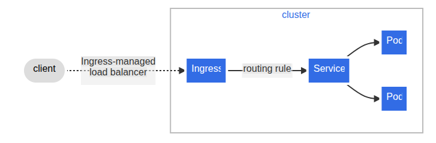

# k8 Objects

## Pods

- **each pods can have multiple containers**
- **pods running = at least one container is running**
- **containers in a pod and communicate via localhost**
- **kubelet is the process that watch and take care of pods in the worker node**
- **Pods are immutable after creation**

## Replicasets

### Shortcomings

- **Manual Update Required**
- **Not a replacement for manual scaling**
- **Lack of Rolling Updates**

## Deployments

- **Deployment is a higher-level abstraction over ReplicaSets and builds on top of ReplicaSets.**
- **Advanced features**
  - **Rolling Updates**
  - **Rollback**
  - **Scaling**
  - **Declarative Updates**

- **In Kubernetes, Deployments detect changes to their Pod template by computing a hash. If the template changes, Kubernetes automatically triggers a rolling update, replacing the old pods with new ones. This is the change-detection mechanism.**
- **default update strategy is RollingUpdate** (create new pods before terminating old ones)
- **other update strategy is Recreate** (terminate all old pods before creating new ones)

## Services

<image src="images/services.png" width=700 />

- **provide stable Ip or DNS to route traffic to pods**

## Services types

<image src="images/services_types.png" width=600 />

### Cluster Ip service

- **default type**
- **exposes the service on a cluster-internal IP**
- **only accessible from within the cluster**

## NodePort service

- **exposes the service on each Node’s IP**
- **a ClusterIP service is automatically created and is accessible only from within the cluster**
- **ClusterIP + NodePort**

## ExternalName

- **Maps the service to external DNS name**
- **use to redirect traffic to outside the cluster**
- **ExternalName Services rely on CNAMEs/DNS resolution**

## LoadBalancer

- **provisions a load balancer for the Service in supported cloud providers**
- **creates a NodePort and ClusterIP service automatically**
- **exposes the service externally using a cloud provider’s load balancer**

---

**🛑 🛑 Service DNS resolution works with just the service name only if the sender and the service are in the same namespace. Otherwise, you must use the Fully Qualified Domain Name (FQDN).**

## 🛑 How kube proxy routes requests

- **each node has one kube proxy**
- **steps**
  1. **Service is just a definition**
  2. **kube-proxy on every node watches for Services**
     - kube-proxy constantly watches the API server for:
       - Service objects
       - Endpoint objects (list of pod IPs that match the Service selector)
  3. **kube-proxy installs routing rules**
     - These rules say:
       - “If traffic comes to ClusterIP:Port → send it to one of these pod IPs”.
  4. **Pod can be anywhere**
     - If the chosen pod is on:
       - Same node → traffic stays local.
       - Different node → kube-proxy routes it through the cluster network to that node’s pod.
  5. **You never “talk to” kube-proxy directly**
     - You connect to the ClusterIP (the virtual IP assigned to the Service).
     - kube-proxy is working in the background on each node to ensure packets are forwarded to the right pod.

## 🛑 Does a Service Belong to One Node?

No — a Service in Kubernetes does not belong to any single node.

**Why?**

- A Service is a cluster-wide resource stored in the Kubernetes API server.
- not tied to any particular node.
- 🛑 All kube-proxy instances on all nodes are aware of every Service and set up the necessary routing rules.

## 🛑 Services are virtual; kube-proxy uses a routing table to forward pod requests to matching pods via the Service’s IP.

## StatefulSets

- **StatefulSets are like Deployments, but with added guarantees about the ordering and uniqueness of Pods.**
- **Create pods with own unique, stable network IDs and stable storage.**
- **Use Cases:**
  - **Databases (e.g., MongoDB, Cassandra)**
  - **Queue systems (e.g., RabbitMQ, Kafka)**
- **Key Features:**
  - **Stable, unique network identifiers**
  - **Stable storage (Persistent Volumes)**
  - **Ordered, graceful deployment and scaling**

- **Each replica in the statefulset gets its own persistent volume claim, which is not shared with other replicas.**
- **Pods names and network IDs are stable and predictable and follow the pattern: `<statefulset-name>-<ordinal-index>`**

- **These volumes can be static or dynamically provisioned.**

- 🛑 🚫 If you want a separate volume per pod, Deployment cannot do that. Only StatefulSets support volumeClaimTemplates → one PVC per pod.

## Headless Service

- **In Kubernetes, a headless service is a Service without a cluster IP.**

- **Normal ClusterIP services get a stable virtual IP that load-balances traffic across the backing pods.**

- **A headless service sets clusterIP: None, which means:**
  - Kubernetes does not allocate a cluster IP.
  - Instead of load balancing, DNS returns the individual pod IPs behind the service.
  - Useful when you need direct pod-to-pod communication, e.g., for databases (MySQL, Cassandra, StatefulSets).

> curl color-ss-0.color-svc

## Ingress

- **Ingress is an API object that manages external access to services in a cluster, typically HTTP.**
- **Provides load balancing, SSL termination, and name-based virtual hosting.**
- **Requires an Ingress Controller to implement the rules defined in the Ingress resource.**
- **Use Cases:**
  - **Expose multiple services under the same IP address using different hostnames or paths.**
  - **Terminate SSL/TLS for secure connections.**

### path-based routing

- **Route traffic based on URL paths to different services.**
- **Example:**
  - `/app1` routes to Service A
  - `/app2` routes to Service B

### host-based routing

- **Route traffic based on the hostname in the request.**
- **Example:**
  - `app1.example.com` routes to Service A
  - `app2.example.com` routes to Service B

### Ingress vs Ingress Controller

- **Ingress** is a set of rules for routing external HTTP/S traffic to services within the cluster.
- **Ingress Controller** is the actual implementation that enforces those rules, typically running as a pod within the cluster.
- **Popular Ingress Controllers:**
  - NGINX Ingress Controller
  - Traefik
  - HAProxy Ingress
  - Istio Ingress Gateway
