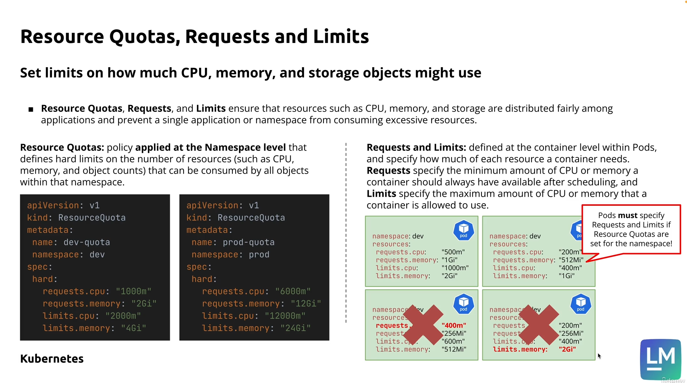
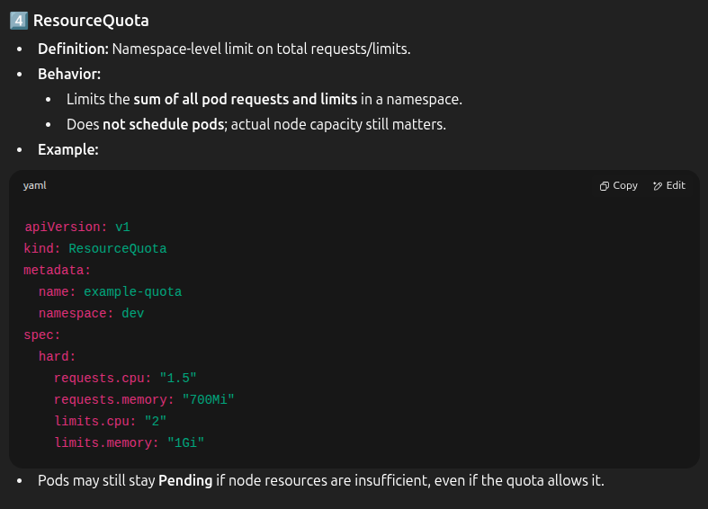

## Quotas, Requests and Limits

### requests means at least these resources must be present in the node

### limit of a pod means resources cannot use more than this amount even if the node has more resources available

### 🛑 Quotas are do not care how much resources are actually available in the node and cluster (cluster memory-1Gi, we still can add 2Gi in quota)

### 🛑 But when applying pods if quota is 1Gi, 1 pod with request.memory 0.5Gi will get created, second pod with request.memory 1Gi will not get created(when apply -f). it will give an error

---

---

---

