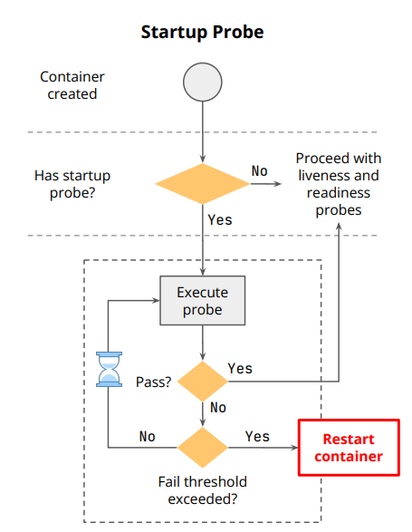
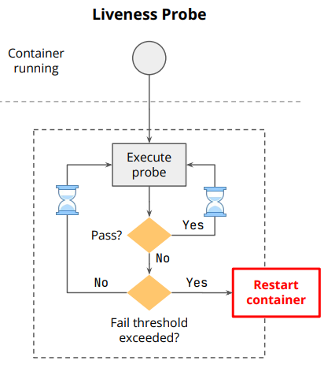
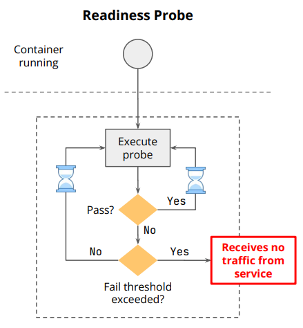

## Health Probes

### Startup Probe

> Ensures that a container has started successfully. If the startup probe fails, Kubernetes will kill the container and attempt to restart it. This probe runs only at the beginning of the container lifecycle.

> Once it succeeds → Kubernetes switches to liveness/readiness checks.

> Purpose: Used for slow-starting containers.

### Liveness Probe

> Checks if the container is still running. If the liveness probe fails, Kubernetes will restart the container. This probe runs periodically throughout the container's lifecycle.

> Purpose: Checks if the container is still alive (running) or stuck.

> If the probe fails → Kubernetes kills the container and restarts it according to the restart policy.

### Readiness Probe

> Checks if the container is ready to accept traffic. If the readiness probe fails, the container is removed from the list of endpoints that receive traffic. This probe also runs periodically during the container's lifecycle.

> Purpose: Checks if the container is ready to serve traffic.

> If it fails → Kubernetes removes the Pod’s IP from the Service’s Endpoints (so no traffic goes to it).

---

## Summary

| Probe         | Checks if…                     | Failure Action                    |
| ------------- | ------------------------------ | --------------------------------- |
| **Liveness**  | Container is still alive       | Restart Pod                       |
| **Readiness** | Container is ready for traffic | Remove from Service load balancer |
| **Startup**   | Container has started properly | Restart Pod                       |

### 🛑 For liveness, readiness, and startup probes, the **kubelet** periodically performs the probe check (HTTP GET, TCP socket, or command execution) according to the probe’s configuration.
