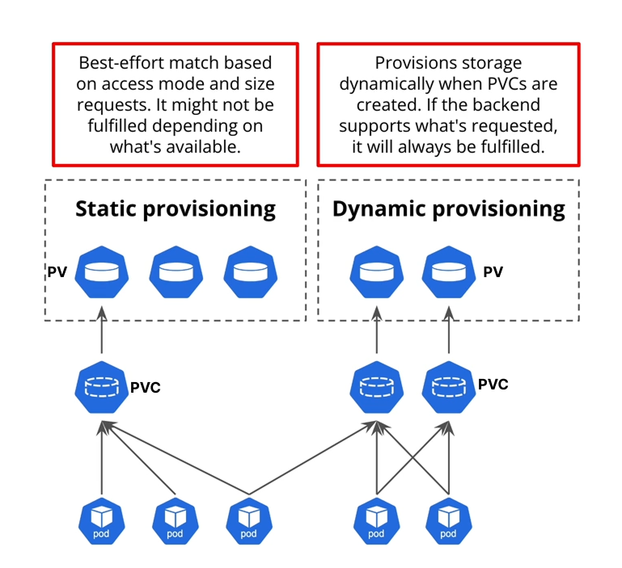
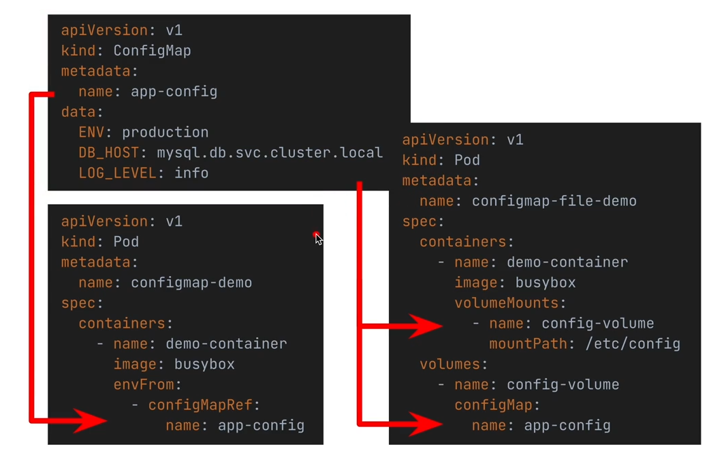

# Volumes

**_Volumes are directories, possibly with some data in it, which are accessible to the containers in a pod._**

## Why use Volumes?

- Containers are ephemeral, meaning that when a container crashes or is restarted, all data stored in the container's filesystem is lost. Volumes provide a way to persist data beyond the lifecycle of a single container.

## Volume Types

### 1. emptyDir

- **Ephemeral storage within the Pod**
- **Data is lost when Pod is removed**
- **All containers in the Pod can read and write the same files**

#### Use Cases

- **Sharing data between multiple containers in a Pod**

---

### 2. local - type of PersistentVolume

- **Mounts a file or directory from the host node's filesystem into your Pod.**
- **superseded hostPath**
- **If a pod is using that local volume, kube-scheduler will only schedule that pod to a node that has the specified local volume.** (That is defined by in configuration)
- **Only support static provisioning.** (need to exist before scheduling)

#### steps

- create a directory on the node
- create a PersistentVolume that points to that directory
- create a PersistentVolumeClaim that binds to that PersistentVolume
- create a Pod that uses that PersistentVolumeClaim

### 3. persistentVolumeClaim

- **Persistent storage that outlives the Pod**
- **PersistentVolumeClaim reserves a PV or create and reserve a new PV**
- **reserves a PV** - static provisioning (need to exist before scheduling)
- **creates and reserves a PV** - dynamic provisioning (on-demand)
- **PersistentVolumeClaim and PersistentVolume has one-to-one mapping.**
- **ReclaimPolicy**

      - Retain = keep PV after PVC is deleted (manual cleanup required) (default for statically provisioned PVs)
      - Recycle = basic scrub (rm -rf /thevolume/*)
      - Delete = delete PV after PVC is deleted (default for dynamically provisioned PVs)

- **😀 In Kubernetes, a Pod cannot connect directly to a PersistentVolume (PV). Instead, it must use a PersistentVolumeClaim (PVC)**

#### Static Provisioning vs Dynamic Provisioning

- **Static Provisioning**: An administrator manually creates a number of PersistentVolumes. Users then create PersistentVolumeClaims to bind to these existing PersistentVolumes.
- **Dynamic Provisioning**: When a PersistentVolumeClaim is created, and if no existing PersistentVolume matches the claim, Kubernetes can automatically provision a new PersistentVolume based on the StorageClass specified in the claim.



### 4. configMap

- **Inject configuration data into Pods**
- **Decouple configuration artifacts from pod**

#### Config maps can we used in the following ways:

- **As environment variables**
- **Mounting as files in a volume** - Each key in the ConfigMap becomes a file in the volume, and the value of the key becomes the content of the file.



### 5. secret

- **Inject sensitive data into Pods**
- **🛑 Stored in base64 encoded format by default, not encrypted**
- **🛑 Can be encrypted at rest**
- **Like ConfigMap, can be used as environment variables or mounted as files in a volume**
- **In addition to generic secrets, Kubernetes supports specific types of secrets for different use cases, such as Docker registry credentials and TLS certificates.**
- **Best practice is not to create secrets from manifest files, but to create them using kubectl**

```bash
kubectl create secret generic my-secret --from-literal=username=myuser --from-literal=password=mypassword
```

### 6. nfs, awsElasticBlockStore, azureDisk, gcePersistentDisk, etc.

- **Cloud provider or network storage solutions**
