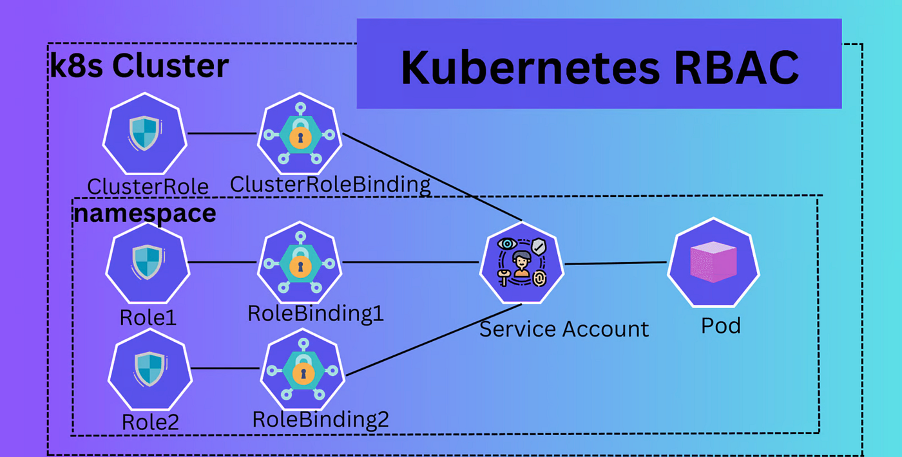
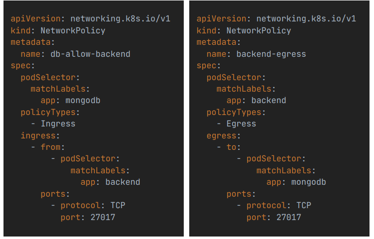
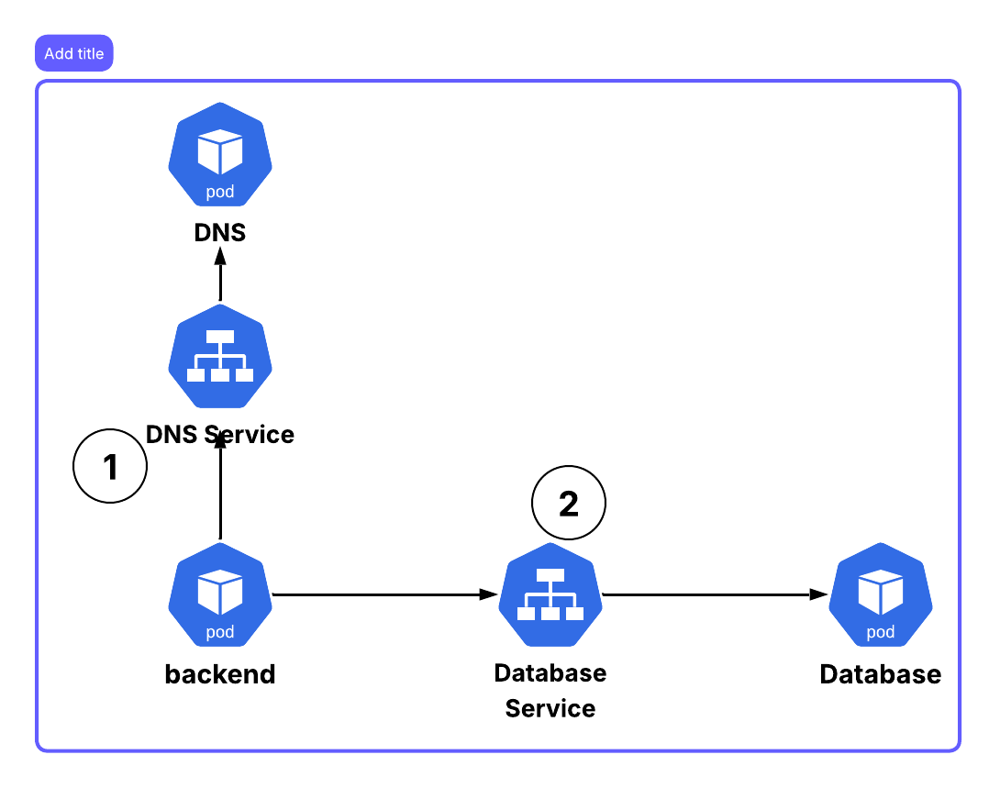

# Security

## Common security risks

- Exposure of control plane and api access
- Insecure workload configuration - e.g., running containers as root
- Overlay permissive role - allowing excessive access to cluster resources
- Insecure network policies - allowing unrestricted traffic between pods
- Unsecured Data at Rest and In Transit

## Security best practices in Kubernetes

- Role-Based Access Control (RBAC): Implement RBAC to restrict access to cluster resources based on user roles.
- Network Policies: Define network policies to control traffic flow between pods and services.
- Pod Security Policies: Use pod security policies to enforce security standards for pod configurations.
- Encryption: Ensure data is encrypted both at rest and in transit.
- Image Security: Use trusted container images and scan them for vulnerabilities.

## Role-Based Access Control (RBAC)

- Five main comoponents:
  - Users, Groups, Service Accounts
    - Users - human operators
    - Groups - collection of users
    - Service Accounts - non-human users for applications running in pods
  - Roles - define permissions within a namespace
  - RoleBindings - bind Roles to Users, Groups, or Service Accounts within a namespace
  - ClusterRoles - define permissions cluster-wide
  - ClusterRoleBindings - bind ClusterRoles to Users, Groups, or Service Accounts cluster-wide


## Kubernetes api

- kubectl, the Kubernetes dashboard, or external services all perform operations through API calls.
- These API requests are sent to the Kubernetes API server, which processes them and communicates with the rest of the cluster components

| kubectl command      | Respective API call                                                                   |
| -------------------- | ------------------------------------------------------------------------------------- |
| `kubectl get pod`    | `GET https://<api-server>/api/v1/namespaces/default/pods`                             |
| `kubectl get pod -A` | `GET https://<api-server>/api/v1/pods`                                                |
| `kubectl get role`   | `GET https://<api-server>/apis/rbac.authorization.k8s.io/v1/namespaces/default/roles` |

### Api path and groups

- API Groups allow Kubernetes to extend and evolve without breaking existing resources or creating conflicts.
- Groups are referenced in the apiVersion field of Kubernetes manifests: apiVersion: <group name>/<version>
- There are two main categories of API groups:

### Core API Group

- Default API Group for Kubernetes’ most essential resources,such as pods, services, configmaps, and namespaces.
- no group name in the apiVersion of our manifests. only the version is specified, e.g., apiVersion: v1
- Accessible under the `/api` top-level path of the Kubernetes API.

```text
https://<api-server>/api/v1/pods
https://<api-server>/api/v1/namespaces
https://<api-server>/api/v1/namespaces/default/secrets
```

### Named API Groups

- Contain additional resources and extend the functionality of Kubernetes.
- Accessible under the /apis top-level path of the Kubernetes API and under their own group path.

```text
https://<api-server>/apis/apps/v1/deployments
https://<api-server>/apis/argoproj.io/v1alpha1/namespaces/<namespace>/rollouts
```

#### sub-resources

- Some Kubernetes resources have sub-resources that provide additional functionality or information related to the main resource.
- Sub-resources are accessed by appending their names to the main resource's API path.

```text
https://<api-server>/api/v1/namespaces/default/pods/<pod-name>/log
https://<api-server>/api/v1/namespaces/default/pods/<pod-name>/exec
https://<api-server>/apis/apps/v1/namespaces/default/deployments/<deployment-name>/scale
```

## Create user and bind role example

### Create private key

```bash
openssl genrsa -out alice.key 2048
```

### Create certificate signing request (CSR)

```bash
openssl req -new -key alice.key -out alice.csr -subj "/CN=alice/O=admin"
```

### Create a Kubernetes CSR object

- This YAML defines a Kubernetes CertificateSigningRequest (CSR) resource — an API object that represents Alice’s certificate request inside Kubernetes.

```yaml
apiVersion: certificates.k8.io/v1
kind: CertificateSigningRequest
metadata:
  name: alice
spec:
  request: NZYUVuQ3F3TDV6cTdnclE2WVhiakJ2cGorVE9IczIyOTZ5d2IwY1NFa2ZNT1BUdVpLSDRGQlJvNDBqCnhaWjdaVHRrN2EybGhLNi84RzJSWXZiRHhGNUhYU0Y5ZUxFQ0d4ZTJqaG5GOUtZT0tBanNkVjV3cUp0a2R0UmoKWHpudXVFZWluRklIc01TRFA3amk2d0pCcEIrUjJlWEtRTEZUL0hGNXRHWEJnUmczWjBJQ0ZtQ2Q0d0MxSHdJRApBUUFCb0FBd0RRWUpLb1pJaHZjTkFRRUxCUUFEZ2dFQkFINU9WUHIrVkpTZ2RwRi9FbEdTdGM0SzFBSHNwUllQClJJbzR2UXZJUUVYbWhTQ2EyR1hIWlFlN0NnTXVTb3BnT0s5V015U2Z2cGJlMjFkTHNKUHhMdFIzRjdrZFFLRzUKUUpoMFUvaWpDcktGMm5peHVlL0g2aWxrZDdFdy9VcVdJUmMvOUJuNVZFREkyREhza1J6MUppQkI3WWpnYnBUbApHNVMzZTZTd3VNazVYMEVIbHVHUk9GYWhlQ29XY0p1SlJQNWpIY2dmZGpkRHhmNElGd1RHTU4vWW84QXU0MjdWClFNMXQwVHdtZkVxdVhOeDhQMzlNRFdOUUdoUWI3U21iMHZsNm1EV3d4TG5lM1ZDRTAxRkFCRlRCZy9tZWt1UEsKQVJDK2hFcGlaMEJRSjRpSG1OTXR2cTZQVEdjQWFWVWpGY0FneUZqanlUb3IxaVZmVnI4WWM2Yz0KLS0tLS1FTkQgQ0VSVElGSUNBVEUgUkVRVUVTVC0tLS0tCg==
  signerName: kubernetes.io/kube-apiserver-client
  expirationSeconds: 86400
  usages:
    - client auth
```

### Submit the CSR to Kubernetes

```bash
kubectl apply -f alice-csr.yaml
```

### Approve the CSR

```bash
kubectl certificate approve alice
```

### Retrieve the signed certificate

```bash
kubectl get csr alice -o jsonpath='{.status.certificate}' | base64 --decode > alice.crt
```

### Create a kubeconfig file for Alice

```bash
# crate kubeconfig file
kubectl config set-cluster my-cluster --server=https://<api-server> --certificate-authority=ca.crt --kubeconfig=alice.kubeconfig
# set user credentials
kubectl config set-credentials alice --client-certificate=alice.crt --client-key=alice.key --kubeconfig=alice.kubeconfig
# set context
kubectl config set-context alice-context --cluster=my-cluster --user=alice --kubeconfig=alice.kubeconfig
# use the context
```

## Service Accounts



- In Kubernetes, a Service Account (SA) is an identity that pods use to interact with the Kubernetes API or other services securely.

> **User accounts** → used by humans (e.g., kubectl, dashboard).

> **Service accounts** → used by processes running inside pods.

- Each pod runs under a specific service account (by default, the default service account in its namespace). By default , default service account have no roles or permissions assigned. But still pods can access configmaps and secrets in the same namespace. Why is that?
  - You’re seeing your pod access a ConfigMap or Secret without RBAC permissions, and that’s 100% expected — because you’re not using the Kubernetes API to read them.
  - You’re using the pod spec mount mechanism, which is handled internally by the kubelet, not by the pod’s service account permissions.
- This account determines what permissions the pod has to access cluster resources.

### Why We Need Service Accounts

- Imagine a pod that needs to:

  - List ConfigMaps,
  - Watch for Secrets,
  - Or call the Kubernetes API.

- If every pod used the same identity, that’s a security risk — a compromised pod could access anything.
- Service accounts allow fine-grained access control using RBAC (Role-Based Access Control).

- Example use cases:
- CI/CD pipelines that deploy to clusters.
- Controllers or operators (like the Horizontal Pod Autoscaler).
- Custom applications needing Kubernetes API access.

### JWT token in service accounts

- When a service account is created, Kubernetes automatically generates a JSON Web Token (JWT) for that account.
- Mounted under `/var/run/secrets/kubernetes.io/serviceaccount/token` inside pods using that service account.

---

---

---

# Network Policy

- A Kubernetes NetworkPolicy is a way to control how pods communicate with each other and with the outside world.
- Think of it as a firewall for pods.
- By default, pods can communicate with any other pod in the cluster (no restrictions).

## What Network Policies Control

1. Ingress – who can send traffic to your pod
2. Egress – where your pod is allowed to send traffic

- In order for Network Policies to have any effect, the CNI (Container Network Interface) plugin used in the cluster must support network policies.



- Does return traffic need to be explicitly allowed?

  - No.
  - Kubernetes NetworkPolicies are stateful (unlike iptables firewall rules that can be stateless).
  - ➡️ This means reply/return traffic is automatically allowed, as long as your policy allows the initial outbound request.

- There are multiple ways we can configure the rules for ingress and egress traffic:
  - Pod Selector: use matchLabels and matchExpressions
  - Namespace Selector: use matchLabels and matchExpressions
  - IP Block: use CIDR blocks
  - Ports and Protocols: define specific ports and protocols

### Egress traffic and DNS problem



- If the backend pods want to make request to the database, it happen through database service.
- So first backend pod should resolve the database service name to an IP address using DNS.
- If there is no egress rule allowing traffic to the DNS server, the DNS resolution will fail, and the backend pod won't be able to connect to the database.
- To fix this, we need to add an egress rule to allow traffic to the DNS server.

```yaml
egress:
  - to:
      - namespaceSelector:
          matchLabels:
            kubernetes.io/metadata.name: kube-system
        podSelector:
          matchLabels:
            k8s-app: kube-dns
```

# ✅ Pod Security Standards (PSS) – A Complete, Easy-to-Learn Guide

Kubernetes Pod Security Standards (PSS) define a set of security requirements for Pods. They help cluster administrators ensure that pods are created with safe configurations, reducing the risk of security vulnerabilities or privilege escalation.

PSS define three security levels:

- Privileged
- Baseline
- Restricted

These standards are implemented using Pod Security Admission (PSA) in Kubernetes 1.25+.

### 🚦 1. Privileged (Most Permissive)

Purpose:

Allows workloads that need powerful access to the node, such as:

- System daemons
- CNI plugins
- Storage drivers

Characteristics:

Privileged mode allows the pod to:

- Run as root unrestricted
- Use host namespaces
- Mount hostPath volumes
- Add any Linux capability
- Use privileged containers

When to use:

Only for trusted infrastructure components.

### ⚖️ 2. Baseline (Middle Ground – Default for Most Workloads)

Purpose:

Block known risky settings while still allowing normal application workloads.

Restrictions Include:

- ❌ No privileged containers
- ❌ No host networking / PID / IPC
- ❌ No hostPath volumes (except read-only, controlled cases)
- ❌ No dangerous capabilities (e.g., SYS_ADMIN)
- ✔️ Running as root is allowed (but controlled)
- ✔️ Some flexible volume plugins allowed

Who uses Baseline?

Developers deploying typical apps that don’t need deep system access.

### 🔒 3. Restricted (Most Secure)

Purpose:

Enforce strong, hardened security suitable for multi-tenant or zero-trust environments.

Restrictions:

- Must run as non-root
- Must drop ALL Linux capabilities
- Only allow safe volume types (ConfigMap, Secret, PVC, downwardAPI)
- No privilege escalation (allowPrivilegeEscalation: false)
- Seccomp profile must be set (RuntimeDefault)
- No host namespace usage
- Read-only root filesystem recommended

Who uses Restricted?

Security-critical workloads, regulated industries, production clusters needing strong isolation.

### 🧩 How Kubernetes Enforces PSS (Pod Security Admission)

You label namespaces with one of the PSS levels:

```bash
pod-security.kubernetes.io/<MODE.: <LEVEL>
```

Where:

- `<MODE>` can be `enforce`, `audit`, or `warn`
- `<LEVEL>` can be `privileged`, `baseline`, or `restricted`  
  Example: Enforce baseline mode in the "dev" namespace:

```bash
kubectl label namespace dev \
    pod-security.kubernetes.io/enforce=baseline
```

```yaml
apiVersion: v1
kind: Namespace
metadata:
  name: privileged
  labels:
    pod-security.kubernetes.io/enforce: privileged
    pod-security.kubernetes.io/warn: baseline
```

available modes:

- enforce → blocks violations
- audit → logs violations
- warn → warns users during apply

Example: Enforce restricted, warn & audit baseline:

```bash
kubectl label namespace secure \
    pod-security.kubernetes.io/enforce=restricted \
    pod-security.kubernetes.io/warn=baseline \
    pod-security.kubernetes.io/audit=baseline
```
