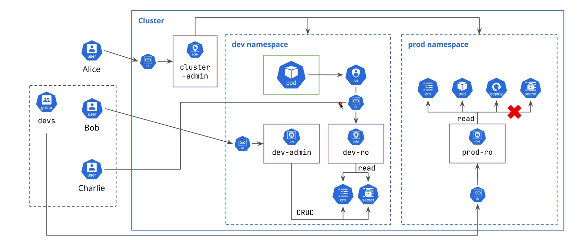

# Security

## Common security risks

- Exposure of control plane and api access
- Insecure workload configuration - e.g., running containers as root
- Overlay permissive role - allowing excessive access to cluster resources
- Insecure network policies - allowing unrestricted traffic between pods
- Unsecured Data at Rest and In Transit

## Security best practices in Kubernetes

- Role-Based Access Control (RBAC): Implement RBAC to restrict access to cluster resources based on user roles.
- Network Policies: Define network policies to control traffic flow between pods and services.
- Pod Security Policies: Use pod security policies to enforce security standards for pod configurations.
- Encryption: Ensure data is encrypted both at rest and in transit.
- Image Security: Use trusted container images and scan them for vulnerabilities.

## Role-Based Access Control (RBAC)

- Five main comoponents:
  - Users, Groups, Service Accounts
    - Users - human operators
    - Groups - collection of users
    - Service Accounts - non-human users for applications running in pods
  - Roles - define permissions within a namespace
  - RoleBindings - bind Roles to Users, Groups, or Service Accounts within a namespace
  - ClusterRoles - define permissions cluster-wide
  - ClusterRoleBindings - bind ClusterRoles to Users, Groups, or Service Accounts cluster-wide

