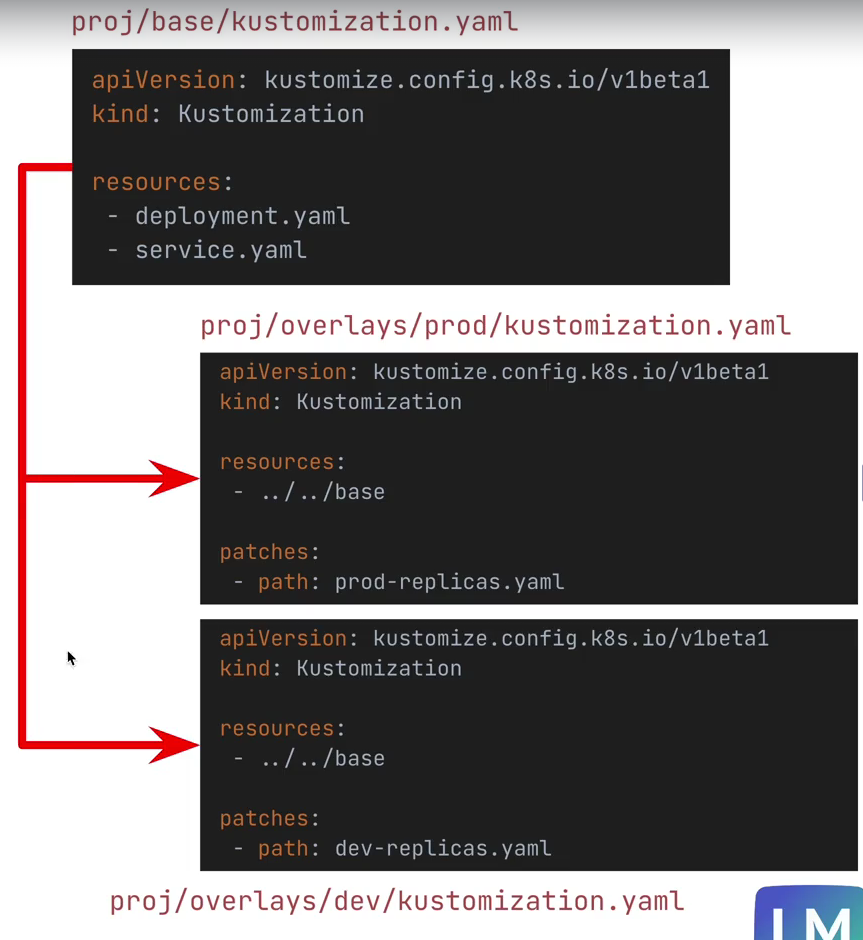
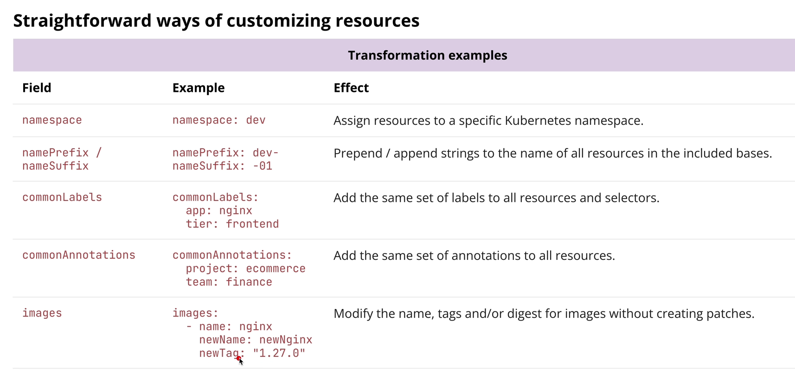

# Kustomize

- Kustomize addresses the challenges of managing configurations of similar applications for different environments, which can
  lead to a lot of duplication and overhead when using only Kubernetes-native manifests
- No templating
- Dynamically generate secrets and configmaps
- Built into kubectl

## Base and Overlays

- A **base** is a set of common YAML configurations that are shared across environments.
- **Overlays** apply environment-specific customizations on top of a base



## Transformations



### ConfigMapGenerator

```yaml
configMapGenerator:
  - name: feature-flag-config
    literals:
      - dbuser=root
      - db=users_db
    options:
      disableNameSuffixHash: true
  - name: db-init-config
    files:
      - db-config=db-init.js
  - name: env_config
    envs:
      - .env
```

after applying kustomize:

```yaml
apiVersion: v1
data:
  db-config: |
    console.log("adding database details");
    console.log("creating user");
    console.log("print success message");
kind: ConfigMap
metadata:
  annotations:
    developer: test@test.com
  labels:
    team: redteam
  name: dev-db-init-config-alpha-kh6cb5cmtb
  namespace: dev
---
apiVersion: v1
data:
  db-url: https:db.com/mydb
kind: ConfigMap
metadata:
  annotations:
    developer: test@test.com
  labels:
    team: redteam
  name: dev-env_config-alpha-6mtf72dtkt
  namespace: dev
---
apiVersion: v1
data:
  db: users_db
  dbuser: root
kind: ConfigMap
metadata:
  annotations:
    developer: test@test.com
  labels:
    team: redteam
  name: dev-feature-flag-config-alpha
  namespace: dev
```

### SecretGenerator

```yaml
secretGenerator:
  - name: db-secret
    envs:
      - .env
    type: Opaque
```

after applying kustomize:

```yaml
apiVersion: v1
data:
  db-url: aHR0cHM6ZGIuY29tL215ZGI=
kind: Secret
metadata:
  annotations:
    developer: test@test.com
  labels:
    team: redteam
  name: dev-db-secret-alpha
  namespace: dev
type: Opaque
```

## Patches

- Patches allow you to modify existing resources without duplicating the entire resource definition.
- You can use patches to change specific fields in a resource, such as updating the number of replicas in a Deployment or changing the image of a container.

### Inline Patches

If your patch is small, you can embed it directly within the kustomization.yaml file using the `patches` field.

```yaml
patches:
  - target:
      kind: Deployment
      name: my-app
    patch: |
      apiVersion: apps/v1
      kind: Deployment
      metadata:
        name: my-app
      spec:
        replicas: 4
```

### Merge Patches (add resources from a file)

For larger patches.

```yaml
patches:
  - path: update-resources.yaml
```

### Remove Resources

```yaml
- path: remove-resources.yaml
    target:
      group: apps
      version: v1
      kind: Deployment
      name: nginx-deployment
```

```yaml
- op: remove
  path: /spec/template/spec/containers/0/resources
```
