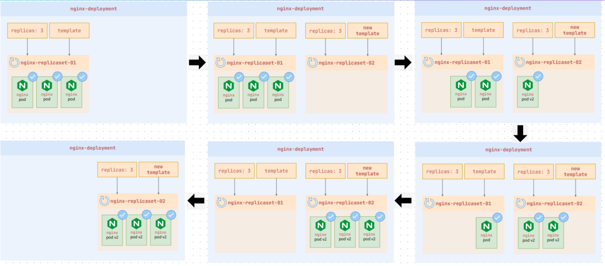

# k8 Objects

## Pods

- **each pods can have multiple containers**
- **pods running = at least one container is running**
- **containers in a pod and communicate via localhost**

## Replicasets

### Shortcomings

- **Manual Update Required**
- **Not a replacement for manual scaling**
- **Lack of Rolling Updates**

## Deployments

- **Deployment is a higher-level abstraction over ReplicaSets and builds on top of ReplicaSets.**
- **Advanced features**

  - **Rolling Updates**
  - **Rollback**
  - **Scaling**
  - **Declarative Updates**

- **In Kubernetes, Deployments detect changes to their Pod template by computing a hash. If the template changes, Kubernetes automatically triggers a rolling update, replacing the old pods with new ones. This is the change-detection mechanism.**
