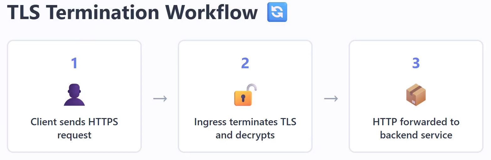

# Ingress

## SSL certificate with ingress

### 1. AWS Load Balancer terminates HTTPS (EKS + AWS Load Balancer Controller)

```
                HTTPS
User
  │
  ▼
AWS Application Load Balancer (ALB)
(SSL certificate from ACM)
  │
  │ HTTP (or HTTPS)
  ▼
Ingress Controller / Kubernetes
  │
  ▼
Service
  │
  ▼
Pod
```

- The SSL certificate is attached to the AWS ALB.
- The ALB performs the TLS handshake.
- Kubernetes never uses the certificate.

### 2. Ingress Controller terminates HTTPS (NGINX/Traefik)

This is common on:

- MicroK8s
- Minikube
- Bare-metal Kubernetes
- On-premises clusters

```
              HTTPS
User
  │
  ▼
NGINX / Traefik Ingress Controller
(cert-manager + Let's Encrypt)
  │
  ▼
Service
  │
  ▼
Pod
```

- cert-manager requests a certificate from Let's Encrypt.
- The certificate is stored as a Kubernetes Secret.
- NGINX or Traefik reads the Secret and performs TLS termination.



---

## Add SSL certificate to Ingress

### Cert-manager

cert-manager is a Kubernetes controller — a set of pods running in your cluster that watch for specific custom resources (CRDs) and act on them. Its entire job is to automate the lifecycle of TLS certificates: requesting, validating, issuing, storing, and renewing them. Before cert-manager existed, people ran certbot manually or via cron jobs — cert-manager brings that same Let's Encrypt automation natively into Kubernetes, using Kubernetes objects instead of shell scripts.

### The Issuer (or ClusterIssuer)

- a CRD (Custom Resource Definition) that defines how cert-manager should obtain certificates for your cluster.
- tells cert-manager who to ask for a certificate and how to prove you own the domain. It's the piece that connects cert-manager to Let's Encrypt (or any other CA).

#### Issuer vs ClusterIssuer

- Issuer — namespaced, only certs in that same namespace can use it
- ClusterIssuer — cluster-wide, any namespace can reference it

### Steps

#### add cert manager to your cluster

```bash
kubectl apply -f https://github.com/cert-manager/cert-manager/releases/download/v1.20.3/cert-manager.yaml
kubectl get pods -n cert-manager
```

- create a ClusterIssuer

```yaml
apiVersion: cert-manager.io/v1
kind: ClusterIssuer
metadata:
  name: letsencrypt-issuer

spec:
  acme:
    email: kavidudharmasiri90@gmail.com

    server: https://acme-v02.api.letsencrypt.org/directory

    privateKeySecretRef:
      name: letsencrypt-issuer-key

    solvers:
      - http01:
          ingress:
            ingressClassName: public
```

```bash
kubectl get clusterissuer
kubectl describe clusterissuer letsencrypt-issuer
```

```yaml
privateKeySecretRef:
  name: letsencrypt-issuer-key
```

- That section tells cert-manager where to store the ACME account's private key.

- What is an ACME account?
  - When cert-manager talks to Let's Encrypt, it first creates an account with Let's Encrypt.
  - That account has:
    - An email address (your email)
    - A private key
    - A corresponding public key

- This is not the SSL certificate for your website.

- Instead, it is the identity cert-manager uses whenever it communicates with Let's Encrypt.

```yaml
solvers:
  - http01:
      ingress:
        ingressClassName: public
```

- A solver tells cert-manager how to prove to the Certificate Authority (Let's Encrypt) that you own a domain.

- Before Let's Encrypt issues a certificate, it must verify that you control the domain (for example, api.example.com). This verification process is called a challenge.

- A solver is the method cert-manager uses to complete that challenge.

- There are two main challenge types supported by Let's Encrypt:
  - HTTP-01
  - DNS-01

1. HTTP-01 Solver

```yaml
solvers:
  - http01:
      ingress:
        ingressClassName: public
```

- Let's Encrypt asks your server to serve a special file at a specific URL:
- 🛑 You cannot obtain a wildcard certificate using the HTTP-01 challenge.

```
http://frontend.kavindu-gihan.online/.well-known/acme-challenge/abc123
```

cert-manager temporarily creates resources so that your ingress controller (in your case, Traefik using the public IngressClass) serves the required response.

```
Internet
    │
    ▼
Traefik
    │
    ▼
Temporary Challenge Pod
    │
    ▼
Returns challenge token
```

2. DNS-01 Solver

- Instead of creating an HTTP endpoint, cert-manager creates a special DNS record.
- Let's Encrypt asks you to add a TXT record such as:

```
Type: TXT

Name:
_acme-challenge.frontend

Value:
SOME_LONG_RANDOM_TOKEN
```

```
Let's Encrypt
       │
       ▼
Checks DNS
       │
       ▼
TXT Record Found
       │
       ▼
Certificate Issued
```

- Advantages
  - Works even if your web server isn't publicly accessible.
  - Supports wildcard certificates (for example, \*.example.com).

#### create an Ingress resource

- 2 certificates for 2 different domains (frontend and backend)

```yaml
apiVersion: networking.k8s.io/v1
kind: Ingress
metadata:
  name: app-ingress
  annotations:
    cert-manager.io/cluster-issuer: letsencrypt-issuer
spec:
  tls:
    - hosts:
        - frontend.kavindu-gihan.online
      secretName: frontend-tls
    - hosts:
        - backend.kavindu-gihan.online
      secretName: backend-tls
  ingressClassName: public
  rules:
    - host: frontend.kavindu-gihan.online
      http:
        paths:
          - path: /
            pathType: Prefix
            backend:
              service:
                name: frontend-svc
                port:
                  number: 80

    - host: backend.kavindu-gihan.online
      http:
        paths:
          - path: /
            pathType: Prefix
            backend:
              service:
                name: backend-svc
                port:
                  number: 8080
```

- 1 certificate for 2 different domains (frontend and backend)

```yaml
apiVersion: networking.k8s.io/v1
kind: Ingress
metadata:
  name: app-ingress
  annotations:
    cert-manager.io/cluster-issuer: letsencrypt-issuer
spec:
  ingressClassName: public

  tls:
    - hosts:
        - frontend.kavindu-gihan.online
        - backend.kavindu-gihan.online
      secretName: app-tls

  rules:
    - host: frontend.kavindu-gihan.online
      http:
        paths:
          - path: /
            pathType: Prefix
            backend:
              service:
                name: frontend-svc
                port:
                  number: 80

    - host: backend.kavindu-gihan.online
      http:
        paths:
          - path: /
            pathType: Prefix
            backend:
              service:
                name: backend-svc
                port:
                  number: 8080
```

- These are what trigger certificate issuance.

```bash
kubectl get certificate
kubectl get certificaterequest
kubectl get orders
kubectl get challenges
kubectl describe certificate
```
